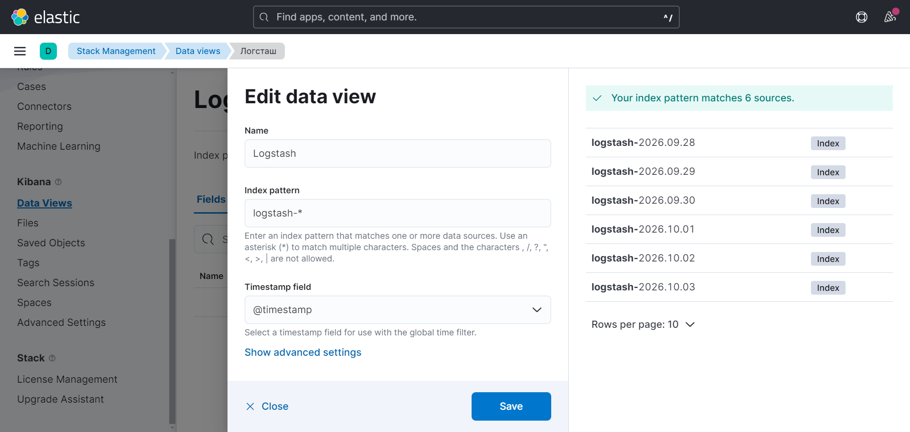
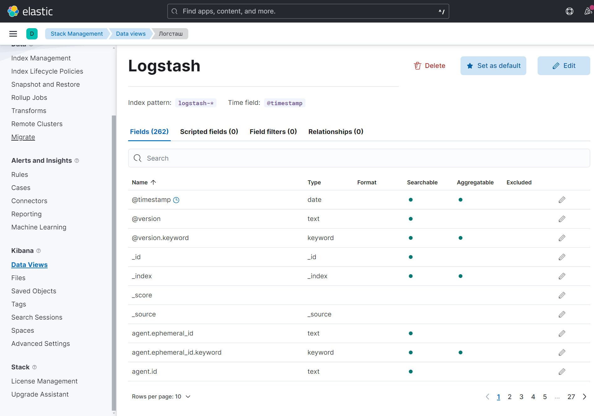
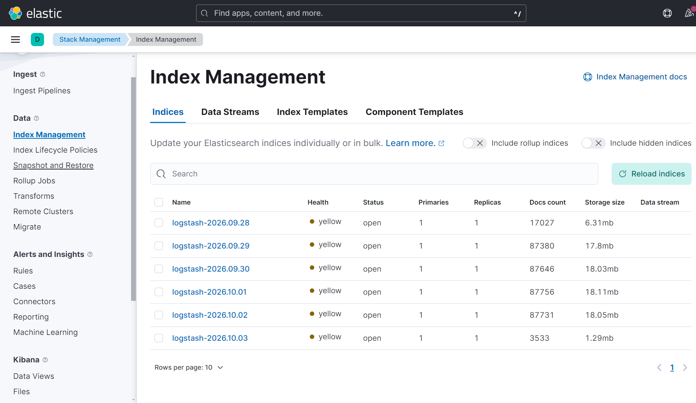
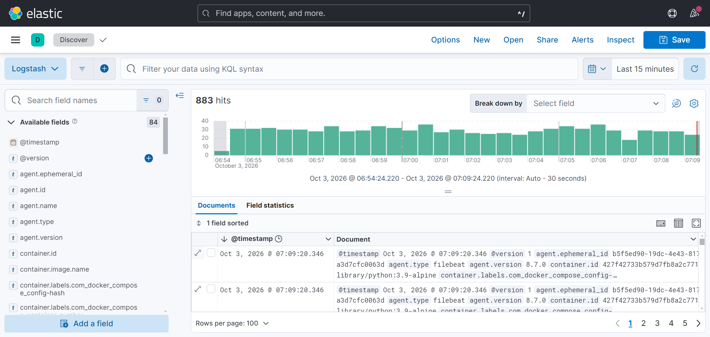
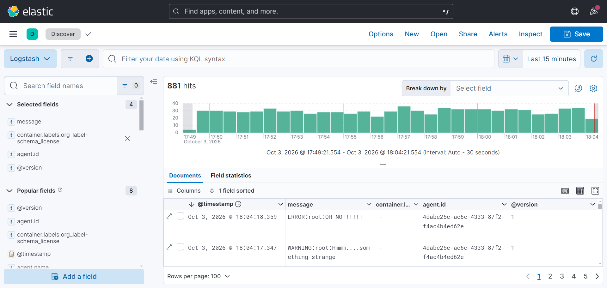

# Домашнее задание к занятию 15 «Система сбора логов Elastic Stack»
Перед выполнением этого домашнего задания необходимо заранее скачать с помощью команыд docker pull образ python:3.9-alpine - без него будет ошибка.</br>
Также необходимо выполнить команду sudo sysctl -w vm.max_map_count=262144 чтобы контейнеры с НОДами работали, иначе они будут падать с ошибкой 78.</br>
## Задание 1
Использовалась папка help. Поднял инфраструктуру в Докере. Контейнеры просканированы спустя более часа, так как я был вынужден исправлять ошибку 78, но всё штатно.</br>
```
tankist@ubuntu:~/mon_hw_03$ docker ps -a
CONTAINER ID   IMAGE                    COMMAND                  CREATED             STATUS             PORTS                                                                                                NAMES
a3d7cfc0063d   elastic/filebeat:8.7.0   "/usr/bin/tini -- /u…"   About an hour ago   Up About an hour                                                                                                        filebeat
776b6034b16e   kibana:8.7.0             "/bin/tini -- /usr/l…"   About an hour ago   Up About an hour   0.0.0.0:5601->5601/tcp, [::]:5601->5601/tcp                                                          kibana
907ff8ef9238   logstash:8.7.0           "/usr/local/bin/dock…"   About an hour ago   Up About an hour   0.0.0.0:5044->5044/tcp, [::]:5044->5044/tcp, 0.0.0.0:5046->5046/tcp, [::]:5046->5046/tcp, 9600/tcp   logstash
955c34dd58ae   elasticsearch:8.7.0      "/bin/tini -- /usr/l…"   About an hour ago   Up 11 minutes      0.0.0.0:9200->9200/tcp, [::]:9200->9200/tcp, 9300/tcp                                                es-hot
427f42733b57   python:3.9-alpine        "python3 /opt/run.py"    About an hour ago   Up About an hour                                                                                                        some_app
83705f9a3b53   elasticsearch:8.7.0      "/bin/tini -- /usr/l…"   About an hour ago   Up 11 minutes      9200/tcp, 9300/tcp                                                                                   es-warm
```
Далее делаем все необходимые проверки:
```
tankist@ubuntu:~/mon_hw_03$ curl -s http://localhost:9200/logs-*/_search?pretty
{
  "took" : 0,
  "timed_out" : false,
  "_shards" : {
    "total" : 0,
    "successful" : 0,
    "skipped" : 0,
    "failed" : 0
  },
  "hits" : {
    "total" : {
      "value" : 0,
      "relation" : "eq"
    },
    "max_score" : 0.0,
    "hits" : [ ]
  }
}

tankist@ubuntu:~$ curl -X GET "http://localhost:9200/_cat/indices?v"
health status index               uuid                   pri rep docs.count docs.deleted store.size pri.store.size
yellow open   logstash-2026.10.02 ix6b7dcES3q-zo80cRZXsg   1   1      87731            0       18mb           18mb
yellow open   logstash-2026.10.03 45PM2uJ3SwSUeJRPeQ_VIw   1   1         51            0    766.3kb        766.3kb
yellow open   logstash-2026.09.29 Bs3anORrTNuI39ybuXptBQ   1   1      87380            0     17.7mb         17.7mb
yellow open   logstash-2026.09.30 uI_mBbX0SbmfW5EtZVqPAQ   1   1      87646            0       18mb           18mb
yellow open   logstash-2026.09.28 bmyCO9IDRNqwDuhhl0doXA   1   1      17027            0      6.3mb          6.3mb
yellow open   logstash-2026.10.01 uQvEqIW7SSSeU-URCGeqjA   1   1      87756            0     18.1mb         18.1mb

tankist@ubuntu:~/mon_hw_03$ docker exec -it 907ff8ef9238 /bin/bash
logstash@907ff8ef9238:~$ curl http://es-hot:9200/
{
  "name" : "es-hot",
  "cluster_name" : "es-docker-cluster",
  "cluster_uuid" : "51MzA9uRTY-VCgugE4ByOw",
  "version" : {
    "number" : "8.7.0",
    "build_flavor" : "default",
    "build_type" : "docker",
    "build_hash" : "09520b59b6bc1057340b55750186466ea715e30e",
    "build_date" : "2023-03-27T16:31:09.816451435Z",
    "build_snapshot" : false,
    "lucene_version" : "9.5.0",
    "minimum_wire_compatibility_version" : "7.17.0",
    "minimum_index_compatibility_version" : "7.0.0"
  },
  "tagline" : "You Know, for Search"
}

logstash@907ff8ef9238:~$ curl -s http://es-hot:9200/_cat/indices?v&expand_wildcards=all&s=index
[1] 325
[2] 326
logstash@907ff8ef9238:~$ health status index               uuid                   pri rep docs.count docs.deleted store.size pri.store.size
yellow open   logstash-2026.10.02 ix6b7dcES3q-zo80cRZXsg   1   1      87731            0       18mb           18mb
yellow open   logstash-2026.10.03 45PM2uJ3SwSUeJRPeQ_VIw   1   1       3533            0      1.9mb          1.9mb
yellow open   logstash-2026.09.29 Bs3anORrTNuI39ybuXptBQ   1   1      87380            0     17.7mb         17.7mb
yellow open   logstash-2026.09.30 uI_mBbX0SbmfW5EtZVqPAQ   1   1      87646            0       18mb           18mb
yellow open   logstash-2026.09.28 bmyCO9IDRNqwDuhhl0doXA   1   1      17027            0      6.3mb          6.3mb
yellow open   logstash-2026.10.01 uQvEqIW7SSSeU-URCGeqjA   1   1      87756            0     18.1mb         18.1mb
[1]-  Done                    curl -s http://es-hot:9200/_cat/indices?v
[2]+  Done                    expand_wildcards=all
```
Логи идут.</br>
Прикрепляю логи контейнеров [filebeat](files/1/filebeat_log.txt) и [logstash](files/1/logstash_log.txt), свидетельствующих об этом.</br>
Заходим в интерфейс Кибаны:</br>

</br>
Рисунок 1.1. Стартовая страница Кибаны.</br>
Создание Data View:

</br>
Рисунок 1.2. Создание Data View.</br>

## Задание 2
Создание индекс - паттернов:

</br>
Рисунок 2.1. Создание индекс - паттернов.</br>
Готовый Data View:

</br>
Рисунок 2.2. Data View Logstash.</br>
Index Management:

</br>
Рисунок 2.3. Index Management Logstash.</br>
Поиск логов. Неструктурированный вывод логов:

</br>
Рисунок 2.4. Неструктурированный вывод логов.</br>
Структурированный вывод логов:

</br>
Рисунок 2.5. Структурированный вывод логов.</br>
На рисунке 2.5. чётко видны рандомные события генерируемые питон скриптом.</br>